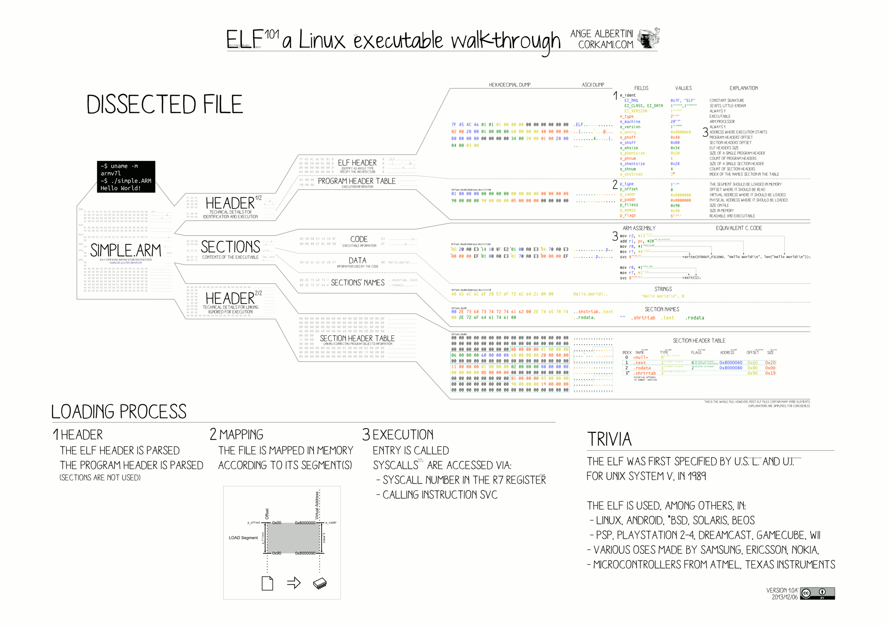

# What is an operating system?

<style>
.kinda-small {
  font-size: 80%;
}
.preserve-text {
  text-transform: none;
}
</style>

##

An operating system is a piece of software (or realistically a bundle of software) that acts as the controller of a physical computer's compute resources.

## What does an OS do?

The OS Dev wiki has a good list of "major OS tasks":

::::{.incremental}
- Managing memory and other system resources.
- Imposing security and access policies.
- Scheduling and multiplexing processes and threads.
- Launching and closing user programs dynamically.
- Providing a basic user interface and application programmer interface.

[critically the interfaces exposed by an OS should be independent of the underlying hardware]{.fragment}
::::

## the kernel

::::{.incremental .kinda-small}
- The kernel is the lowest level part of an operating system
- It manages the creation and allocation of programs and shared system resources.
- It interfaces with hardware via specialized drivers and presents a unified interface to programs.
- It's also the ultimate privileged context, since it controls when programs run and what they can and can't do.
- Individual programs that run underneath the kernel without this privilege are said to run in "userland."
::::

# Memory

## Strategies for memory management

::::{.incremental}
- physical memory
- virtual memory
  - segmented memory
  - paged memory
::::

## Physical Memory

::::{.incremental .kinda-small}
- Physical memory is a very simple concept:
- All the programs share the same address space which is mapped 1:1 with physical memory.
- This memory scheme is very easy to understand and implement, but it comes with some drawbacks.
- you can never allocate more memory than you have physically available (more on this later).
- Buggy or malicious programs can read and write to memory used by other programs or the OS.
- Still sometimes used in embedded contexts.
::::

## Virtual Memory

::::{.incremental .kinda-small}
- Virtual memory adds an abstract, or *virtual*, address space between physical memory and programs.
- This means that multiple programs can use the same memory addresses without them colliding,
- And most importantly, it means that programs can't see or modify each others' memory.
::::

## Segmented Memory

::::{.incremental .kinda-small}
- Segmented memory achieves virtual memory using a set of "program segments" 
- these segments are effectively separate address spaces
- This makes pointers complicated and introduces the concept of "near" and "far" pointers, for pointers to memory in the same and different segments respectively
- even when segmented memory was the norm, many systems would simply overlap all the segments to avoid a need to distinguish near and far pointers.
::::

##


## Paged Memory

::::{.incremental .kinda-small}
- Paged memory achieves virtual memory by mapping fixed size blocks of memory (called pages) between virtual and physical addresses
- This system doesn't require "near" and "far" pointers
- Increased memory metadata overhead
- Pages can exist without any real RAM backing them as long as they're never accessed causing them to be loaded (or "faulted")
- Easily allows pages to be "swapped," that is, written out to disk to recover RAM.
- The strategy used by most modern, non-embedded operating systems.
::::

# System resources

## Filesystems

::::{.incremental .kinda-small}
- Filesystems provide a way for programs to organize and store data
- Most filesystems do this as a hierarchical tree composed of directories (branch nodes), and files (leaf nodes),
- However some support other structures like symbolic links, which act as "references" to files elsewhere,
- Or even "virtual" file types like sockets and pipes that act as interfaces for programs to communicate.
- Some filesystems aren't even backed by disks...
::::

## File descriptors and sockets

::::{.incremental .kinda-small}
- Some resources are allocated internally by the kernel and accessed via symbolic resources.
- For example when a program opens a file, that file is represented by a numeric value
  - on UNIX this is called a file descriptor and is a small, positive `int`
  - on Windows this is called a file handle and is a custom type `HANDLE` (which resolves to a `void*`)
- file descriptors can also represent other resources like networking sockets and directories
::::

# Processes and scheduling

## Just don't!

::::{.incremental .kinda-small}
- Single task operating systems like DOS and some embedded OSes don't have processes and therefore don't do scheduling.
- This also entirely circumvents the major desire for virtual memory.
- as you can imagine those two things save a lot of performance overhead.
- however, most people want their desktop operating system to be "multitasking" to allow multiple user programs to run simultaneously, as well as daemons to handle networking and other systems tasks
::::

## ...or maybe we should

::::{.incremental .kinda-small}
- as a result, basically all desktop operating systems since the DOS days are multitasking and schedule multiple process to allow many programs to run simultaneously
- how this scheduling occurs and what guarantees can be made about how often and long a process will be scheduled categorize multitasking operating systems into categorizes like: [asnyc]{.fragment}[, soft‑realtime]{.fragment}[, and hard‑realtime.]{.fragment}
- these terms refer to when and how different programs and the kernel may interrupt each other.
- they have different pros and cons in reliability, performance, and convenience, and a fully nuanced discussion could fill most of another presentation
::::

# Running programs

## Binary Loading

::::{.incremental .kinda-small}
- A general purpose OS will typically implement some kind of binary loader.
- This is the mechanism that converts an executable file into a running process.
- Very broadly, this is done by:
  - parsing the binary file format (ELF, PE, etc.)
  - allocating a PID, virtual address space, and other kernel state
  - loading the different regions of data (called segments) into memory at the specified locations
  - beginning execution at the specified start point (usually denoted by the symbol `_start`)
::::

##



## File Extensions

::::{.incremental .kinda-small}
- Most operating systems only nativity understand one or two file formats:
  - Windows understands the PE executable format
  - Linux understands the ELF executable format and shebang (`#!`) scripts
  - MacOS understands the Mach-O executable format and shebang scripts
- To make up for this limitation, we have file extensions; 
- these are used by higher level OS components like file managers to open certain files with certain programs,
- this allows an OS to "understand" things like PDF documents, PNG images, etc.
::::

# [UIs & APIs]{.preserve-text}

## Minimal User Interface

::::{.incremental .kinda-small}
- This changes a lot depending on what the intended usecase is, so lets look at a few examples:
  - Linux has the TTY, a kernel emulation of a **T**ele**TY**pe terminal.
  - Windows has a simple window manager and interface for launching command prompt sessions
  - MacOS...  Well MacOS *does* have a TTY under all the GUI stuff, but if you ever reach the point that you see it your system is probably irrecoverably broken
::::

## OS-Level [APIs]{.preserve-text}

::::{.incremental .kinda-small}
- Because system resources are shared and the kernel runs in a "privileged" context, programs can't directly invoke kernel routines;
- Instead, programs can make "system calls" (or syscalls).
- When a program makes a system call, execution transfers to the kernel, which looks at the requested system call, checks if the program is authorized to perform that operating, and then performs the requested action or returns an error.
- This is done either through a software interrupt or a dedicated processor instruction.
::::

#

```
$ ./a.out
Bad system call (core dumped)
```
